# Faculty Research Opportunity Notifier (PI rate research)

This project is an AI-driven multi-agent system designed to connect university faculty with relevant research funding opportunities. The system proactively identifies new grants, matches them to faculty expertise, generates preliminary research ideas, and suggests potential collaborators.

## Architecture Overview

The system is built as a Python **FastAPI** application, designed for scalability and containerization with **Docker**.

It employs a multi-agent architecture where specialized agents collaborate to perform the full workflow. Agent-to-agent (A2A) communication is intended to be handled by the **Google Agent Development Kit (ADK)**, with agents exposing their capabilities via the **Model Context Protocol (MCP)** for standardized tool calling.

## Repository Structure

The project follows a standard Python application layout:

```
.
├── .dockerignore
├── .gitignore
├── Dockerfile
├── README.md
├── development_checklist.yaml
├── requirements.txt
├── data/
│   ├── raw/          # Raw, unprocessed data from scrapers
│   └── processed/    # Cleaned, structured data for agents
├── src/
│   ├── __init__.py
│   ├── main.py       # FastAPI application entry point
│   ├── agents/       # Core logic for each specialized agent
│   ├── core/         # Core components like Pydantic models, A2A config
│   └── tools/        # Reusable tools (e.g., web scrapers, API clients)
└── tests/
    ├── __init__.py
    ├── mock_data/    # Static HTML/JSON for testing scrapers/parsers
    ├── agents/
    ├── core/
    └── tools/
```

## System Architecture

The system uses a **multi-agent architecture** with **Agent-to-Agent (A2A) communication** following the Model Context Protocol (MCP). Each agent is specialized for specific tasks and can be called independently or as part of an orchestrated pipeline.

### Core Agents

1. **Database Discovery Agent** - Automatically discovers and integrates new academic/funding databases
2. **Ingestion Agent** - Collects funding opportunities and faculty data from multiple sources  
3. **Matcher Agent** - Multi-dimensional scoring to match faculty with relevant funding
4. **Idea Generation Agent** - Generates research proposal variants using LLMs
5. **Collaborator Agent** - Identifies potential research collaborators
6. **Notification Agent** - Formats and sends personalized notifications
7. **Admin Dashboard Agent** - System monitoring and analytics

### Data Flow (Mermaid Diagram)

```mermaid
graph TD
    subgraph "🔍 Discovery & Ingestion"
        A[New Database URL] -->|A2A Request| DD{Database Discovery Agent}
        DD -->|Generates Config & Tests| DB[(Database Configs)]
        
        FW[Funding Websites<br/>NIH, PCORI, NSF] -->|Web Scraping| IA{Ingestion Agent}
        FA[Faculty APIs<br/>PubMed, arXiv, ORCID] -->|API Calls| IA
        DB --> IA
        IA -->|Stores Raw Data| RD[(Raw Data<br/>data/raw/)]
    end

    subgraph "🤖 Analysis & Generation"
        RD --> MA{Matcher Agent}
        MA -->|Multi-dimensional Scoring| SM[Scored Matches]
        
        SM --> IGA{Idea Generation Agent}
        SM --> CA{Collaborator Agent}
        
        IGA -->|Conservative/Innovative/Stretch<br/>+ Budget/Timeline| PI[Proposal Ideas]
        CA -->|Research Collaborators| CS[Collaborator Suggestions]
        
        PI --> ED[Enriched Data Object]
        CS --> ED
    end

    subgraph "📊 Dashboard & Export"
        ED --> ADA{Admin Dashboard Agent}
        ED --> ET{Export Tools}
        ADA -->|Analytics & Monitoring| SM2[System Metrics]
        ET -->|Formatted Proposals| EO[Export Outputs]
    end

    subgraph "📧 Notification"
        ED --> NA{Notification Agent}
        NA -->|Personalized Email| FM((👨‍🔬 Faculty Member))
    end

    subgraph "🔗 A2A Communication Layer"
        API[FastAPI Endpoint<br/>/run-analysis] -->|Triggers| IA
        IA -.->|A2A Message| MA
        MA -.->|A2A Message| IGA
        MA -.->|A2A Message| CA
        IGA -.->|A2A Message| NA
        CA -.->|A2A Message| NA
        
        ADMIN[Admin Dashboard] -->|A2A Request| DD
        IA -->|A2A Request| DD
    end

    style DD fill:#ff9999,stroke:#333,stroke-width:2px
    style RD fill:#f9f,stroke:#333,stroke-width:2px
    style ED fill:#ccf,stroke:#333,stroke-width:2px
    style FM fill:#cfc,stroke:#333,stroke-width:2px
```



### Adding New Data Sources

The **recommended approach** is to use the interactive CLI program (`python manage_research_system.py`), which provides guided workflows for adding new sources.

For advanced users or programmatic integration, the system also supports **dynamic database discovery** via the Database Discovery Agent's A2A protocol:

#### For Faculty/Academic Sources:
```python
# Basic integration (config + tests + mock data)
message = create_artifact_generation_message(
    source_agent=AgentType.ADMIN_DASHBOARD,
    database_url="https://api.semanticscholar.org/graph/v1/paper/search",
    database_name="Semantic Scholar",
    artifacts=[ArtifactType.CONFIG_FILE, ArtifactType.TEST_FILE, ArtifactType.MOCK_DATA]
)

# Full integration with documentation
message = create_artifact_generation_message(
    source_agent=AgentType.ADMIN_DASHBOARD,
    database_url="https://api.ieee.org/search",
    database_name="IEEE Xplore",
    artifacts=[
        ArtifactType.CONFIG_FILE,
        ArtifactType.TEST_FILE,
        ArtifactType.MOCK_DATA,
        ArtifactType.DOCUMENTATION,
        ArtifactType.INTEGRATION_GUIDE,
        ArtifactType.PLUGIN_CODE  # Custom plugin template
    ]
)

# Via direct call (uses default artifacts)
result = ingestion_agent.add_new_database(
    database_url="https://api.crossref.org/works",
    database_name="Crossref",
    database_type="faculty"
)
```

#### For Funding Sources:
```python
# API-based funding source with full documentation
message = create_artifact_generation_message(
    source_agent=AgentType.ADMIN_DASHBOARD,
    database_url="https://api.grants.gov/v1/opportunities",
    database_name="Grants.gov API",
    artifacts=[
        ArtifactType.CONFIG_FILE,
        ArtifactType.TEST_FILE,
        ArtifactType.DOCUMENTATION,
        ArtifactType.INTEGRATION_GUIDE
    ]
)

# Just generate documentation for existing source
message = create_artifact_generation_message(
    source_agent=AgentType.ADMIN_DASHBOARD,
    database_url="https://www.nsf.gov/api/awards",
    database_name="NSF Awards",
    artifacts=[ArtifactType.DOCUMENTATION]
)
```

#### Flexible Artifact Generation:
The system now supports **6 artifact types**:
- `CONFIG_FILE` - Database configuration YAML
- `TEST_FILE` - Pytest test file with mocks
- `MOCK_DATA` - Realistic JSON test data
- `DOCUMENTATION` - API integration docs
- `INTEGRATION_GUIDE` - Step-by-step setup guide
- `PLUGIN_CODE` - Custom plugin template

**Mix and match** as needed - no more rigid "both" limitations!

> **💡 Tip:** The above A2A protocol examples are for advanced programmatic usage. For most developers, the interactive CLI (`python manage_research_system.py`) provides the same functionality with a much simpler interface!

## Setup and Usage

1. **Install Dependencies:**
  
  ```
  pip install -r requirements.txt
  ```
  
2. **Run Tests:**
  
  Ensure all components are working as expected.
  
  ```
  pytest
  ```
  
3. **Start the Application:**
  
  This will start the Uvicorn server.
  
  ```
  uvicorn src.main:app --reload
  ```
  
  The API will be available at `http://127.0.0.1:8000`.

## Developer Interface (Primary Method)

The system includes an **interactive CLI program** that simplifies system management and extensions. This is the **recommended way** for developers to work with the system.

### Interactive System Manager

Start the interactive CLI:

```bash
python manage_research_system.py
```

The CLI provides a menu-driven interface with the following options:

1. **Add new funding source** - Automatically integrate websites or APIs for funding opportunities
2. **Add new faculty/academic database** - Integrate new academic databases (PubMed, arXiv, etc.)
3. **Generate documentation** - Create API docs and integration guides for existing databases
4. **Run system health check** - Verify all components are working correctly
5. **View system status** - See configured sources, test files, and recent data
6. **Test database connection** - Validate API connectivity before integration
7. **Show configuration files** - Review current system configuration

### Key Benefits of the CLI:

- **No A2A protocol knowledge required** - The CLI handles complex inter-agent communication
- **Guided workflows** - Step-by-step prompts for all operations
- **Flexible artifact generation** - Choose exactly what gets generated (config, tests, docs, etc.)
- **Built-in validation** - Test connections and configurations before integration
- **Progress tracking** - See exactly what files are created and where

### Example CLI Usage:

```bash
# Start the interactive manager
python manage_research_system.py

# The CLI will guide you through options like:
# → Choose what to generate: Basic integration, Full package, Documentation only
# → Select artifact types: config files, tests, mock data, documentation, guides
# → Test API connections before integration
# → View system status and health checks
```
  

## Containerization

Build and run the application using Docker:

1. **Build the image:**
  
  ```
  docker build -t research-agent-system .
  ```
  
2. **Run the container:**
  
  ```
  docker run -p 8000:8000 research-agent-system
  ```
