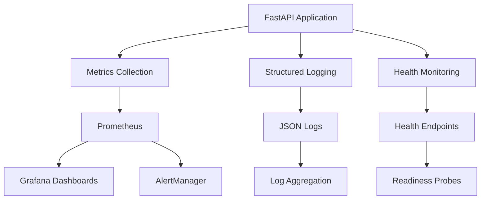
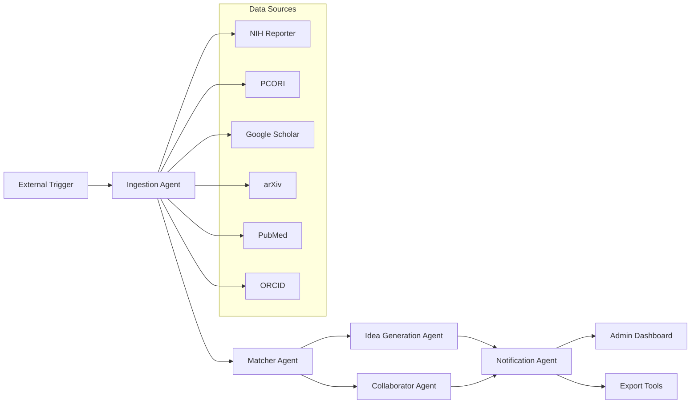
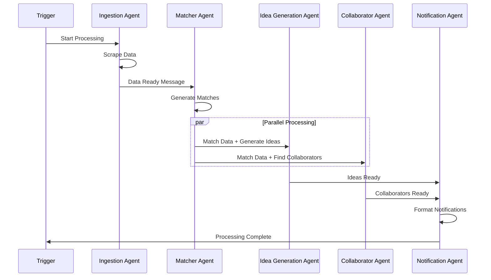
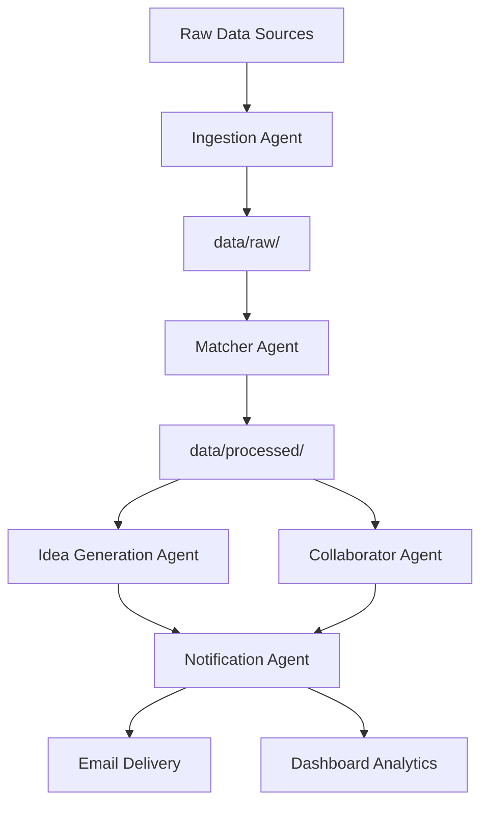
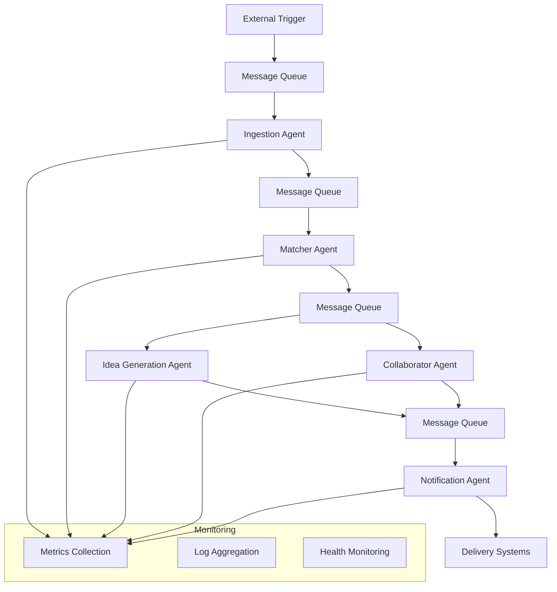

# Multi-Agent System Architecture

## Overview

The Faculty Research Opportunity Notifier is built as a multi-agent system where specialized agents collaborate to process research funding opportunities and match them with faculty profiles. The system is designed for scalability, observability, and future Agent-to-Agent (A2A) communication capabilities.

## Architecture Principles

- **Separation of Concerns**: Each agent has a specific responsibility
- **Loose Coupling**: Agents communicate through well-defined interfaces
- **Observability**: Comprehensive monitoring and logging at every level
- **Scalability**: Agents can be scaled independently
- **Fault Tolerance**: Circuit breakers and graceful degradation
- **Future-Ready**: Designed for A2A communication in Phase 5

## System Components

### Core Infrastructure



### Multi-Agent Pipeline



## Agent Specifications

### 1. Ingestion Agent

**Purpose**: Collects data from external sources and stores it in structured format.

**Responsibilities**:
- Web scraping of funding opportunities (NIH, PCORI)
- Academic database queries (Google Scholar, arXiv, PubMed, ORCID)
- Data validation and normalization
- Storage in `data/raw/` directory

**Key Metrics**:
- `funding_opportunities_scraped_total`
- `faculty_profiles_discovered_total`
- `external_api_calls_total`

**Configuration**:
- `config/scraping_urls.yaml`
- `config/faculty_search_sources.yaml`

### 2. Database Discovery Agent

**Purpose**: Automatically discovers and integrates new academic/funding databases.

**Responsibilities**:
- API endpoint discovery and testing
- Configuration generation for new sources
- Test data generation for validation
- A2A protocol message handling

**Key Features**:
- Plugin architecture for new database types
- Automatic mock data generation
- Dynamic configuration management

### 3. Matcher Agent

**Purpose**: Multi-dimensional scoring system for matching opportunities with faculty.

**Responsibilities**:
- Research methodology alignment scoring
- Career stage consideration
- Deadline urgency weighting
- Comprehensive match scoring

**Scoring Dimensions**:
- **Methodology Alignment** (40%): NLP-based similarity scoring
- **Career Stage** (30%): Assistant/Associate/Full Professor matching
- **Deadline Urgency** (20%): Time-based urgency scoring
- **Collaboration Potential** (10%): Cross-disciplinary opportunity identification

**Key Metrics**:
- `matches_generated_total{match_score_range}`
- `agent_execution_duration_seconds{agent_name="matcher"}`

### 4. Idea Generation Agent

**Purpose**: Generates multiple proposal variants with budget and timeline estimates.

**Responsibilities**:
- Conservative proposal variant generation
- Innovative approach suggestions
- Stretch goal proposal creation
- Budget estimation and timeline planning

**Proposal Variants**:
- **Conservative**: Low-risk, proven methodologies
- **Innovative**: Novel approaches with moderate risk
- **Stretch**: High-impact, high-risk proposals

**Key Features**:
- LLM integration for idea generation
- Budget estimation algorithms
- Timeline planning with milestone identification

### 5. Collaborator Suggestion Agent

**Purpose**: Identifies potential collaborators for research opportunities.

**Responsibilities**:
- Faculty expertise overlap analysis
- Cross-disciplinary collaboration identification
- Institution and geographic considerations
- Collaboration history analysis

**Matching Criteria**:
- Research area overlap
- Complementary expertise
- Previous collaboration success
- Geographic proximity (if relevant)

### 6. Notification Agent

**Purpose**: Formats and prepares personalized email notifications.

**Responsibilities**:
- Email template generation
- Personalization based on faculty profile
- Multi-format output (HTML, plain text)
- Delivery scheduling and tracking

**Email Components**:
- Opportunity summary
- Match explanation
- Proposal variants
- Collaboration suggestions
- Next steps and deadlines

### 7. Admin Dashboard

**Purpose**: System monitoring, analytics, and configuration management.

**Responsibilities**:
- Real-time system health monitoring
- Performance analytics and reporting
- Configuration management interface
- User access and permission management

**Dashboard Features**:
- System metrics visualization
- Agent performance monitoring
- Data ingestion status
- Match quality analytics

## Agent-to-Agent (A2A) Communication (Phase 5)

### Current State (Phase 1-4)
- Direct function calls between agents
- Synchronous processing pipeline
- In-memory data passing

### Future State (Phase 5)
- Google Agent Development Kit (ADK) integration
- Model Context Protocol (MCP) standardization
- Asynchronous message passing
- Distributed agent deployment

### A2A Message Flow



### Message Types

**Trigger Messages**:
- `PROCESS_START`: Initiates the pipeline
- `DATA_UPDATED`: New data available for processing

**Data Messages**:
- `FUNDING_DATA`: Scraped funding opportunities
- `FACULTY_DATA`: Faculty profile information
- `MATCH_RESULTS`: Matching results with scores

**Control Messages**:
- `AGENT_READY`: Agent initialization complete
- `PROCESSING_COMPLETE`: Task finished successfully
- `ERROR_OCCURRED`: Error handling and recovery

**Status Messages**:
- `HEALTH_CHECK`: Agent health verification
- `PERFORMANCE_METRICS`: Agent performance data

### Communication Protocols

**Message Structure**:
```json
{
  "message_id": "uuid",
  "sender_agent": "ingestion_agent",
  "receiver_agent": "matcher_agent",
  "message_type": "DATA_READY",
  "timestamp": "2025-01-01T12:00:00Z",
  "correlation_id": "request_uuid",
  "payload": {
    "data_type": "funding_opportunities",
    "record_count": 150,
    "data_location": "data/processed/funding_2025-01-01.json"
  },
  "metadata": {
    "priority": "normal",
    "retry_count": 0,
    "expires_at": "2025-01-01T13:00:00Z"
  }
}
```

**Error Handling**:
- Automatic retry with exponential backoff
- Dead letter queue for failed messages
- Circuit breaker pattern for unhealthy agents
- Graceful degradation strategies

## Data Flow Architecture

### Phase 1-4: Direct Pipeline



### Phase 5: A2A Communication



## Monitoring and Observability

### Metrics Collection

**Application Metrics**:
- HTTP request rates and latencies
- Agent execution times and success rates
- Queue sizes and processing throughput
- External API call performance

**System Metrics**:
- CPU, memory, and disk usage
- Network I/O and connection counts
- Database connection pool status
- Cache hit/miss ratios

**Business Metrics**:
- Match quality scores and distribution
- Notification delivery rates
- User engagement metrics
- Data freshness and completeness

### Logging Strategy

**Structured Logging**:
```json
{
  "timestamp": "2025-01-01T12:00:00Z",
  "level": "INFO",
  "service": "research-opportunity-notifier",
  "agent": "matcher_agent",
  "correlation_id": "req-12345",
  "event_type": "match_generated",
  "message": "Generated match for faculty member",
  "data": {
    "faculty_id": "faculty-456",
    "opportunity_id": "nih-789",
    "match_score": 0.85,
    "processing_time_ms": 1250
  }
}
```

**Log Categories**:
- **Application Logs**: Agent execution and business logic
- **Security Logs**: Authentication, authorization, and audit trails
- **Performance Logs**: Slow queries, high resource usage
- **Integration Logs**: External API calls and responses

### Health Monitoring

**Health Check Levels**:
1. **Basic Health** (`/health`): Service responsiveness
2. **Detailed Health** (`/health/detailed`): Component status and metrics
3. **Readiness** (`/health/ready`): Dependency availability

**Component Health Checks**:
- Database connectivity
- External API availability
- Message queue status
- File system accessibility
- Agent responsiveness

## Security Architecture

### Current Security (Phase 1-4)

**API Security**:
- Request/response logging
- Rate limiting preparation
- Input validation
- CORS configuration

**Data Security**:
- Data encryption at rest (planned)
- Secure API key management
- Access logging and auditing

### Future Security (Phase 5+)

**Authentication & Authorization**:
- JWT token-based authentication
- Role-based access control (RBAC)
- API key management
- OAuth 2.0 integration

**A2A Security**:
- Message encryption
- Agent identity verification
- Secure key exchange
- Message integrity validation

## Deployment Architecture

### Development Environment

```yaml
services:
  research-api:
    build: .
    ports: ["8000:8000"]
    environment:
      - LOG_LEVEL=DEBUG
      - METRICS_ENABLED=true
  
  prometheus:
    image: prom/prometheus
    ports: ["9090:9090"]
  
  grafana:
    image: grafana/grafana
    ports: ["3000:3000"]
```

### Production Environment (Future)

```yaml
services:
  research-api:
    image: research-system:latest
    replicas: 3
    resources:
      limits: {cpu: "1", memory: "2Gi"}
      requests: {cpu: "500m", memory: "1Gi"}
    
  redis:
    image: redis:alpine
    replicas: 1
    
  postgres:
    image: postgres:13
    replicas: 1
```

## Configuration Management

### Environment-Specific Configuration

**Development**:
- Debug logging enabled
- Mock external APIs
- Local file storage
- Single agent instances

**Staging**:
- Production-like configuration
- Real external API integration
- Distributed storage
- Load testing capabilities

**Production**:
- Optimized performance settings
- High availability configuration
- Security hardening
- Comprehensive monitoring

### Dynamic Configuration

**Agent Configuration**:
- Runtime parameter adjustment
- Feature flag management
- Performance tuning
- A2A protocol settings

## Future Enhancements

### Phase 5: A2A Communication
- Google ADK integration
- MCP protocol implementation
- Distributed agent deployment
- Advanced message routing

### Phase 6: Research-Forward Features
- Structured research question generation
- Methodology tagging and classification
- Literature gap identification
- Plugin architecture for research modules

### Phase 7: Advanced Capabilities
- Research Agent for automated literature review
- Data simulation and analysis
- Proposal writing assistance
- Grant application automation

## Performance Benchmarks

### Target Performance Metrics

**Response Times**:
- Health checks: < 100ms
- Basic API calls: < 500ms
- Agent processing: < 30s
- End-to-end pipeline: < 5 minutes

**Throughput**:
- 1000+ opportunities processed/hour
- 500+ faculty profiles analyzed/hour
- 100+ matches generated/hour
- 50+ notifications sent/hour

**Availability**:
- 99.9% uptime target
- < 1s recovery time for health checks
- Graceful degradation under load
- Zero-downtime deployments

## Troubleshooting Guide

### Common Issues

**High CPU Usage**:
1. Check agent execution metrics
2. Review processing queue sizes
3. Analyze external API response times
4. Scale agent instances if needed

**Memory Leaks**:
1. Monitor memory usage trends
2. Check for unclosed connections
3. Review data processing batch sizes
4. Restart agents if necessary

**External API Failures**:
1. Check circuit breaker status
2. Review rate limiting metrics
3. Verify API key validity
4. Enable fallback mechanisms

### Monitoring Dashboards

**System Overview**: High-level health and performance
**Agent Performance**: Individual agent metrics and execution times
**External Services**: API call success rates and response times
**Security Events**: Authentication failures and suspicious activity

This architecture document serves as the foundation for understanding, developing, and operating the multi-agent Faculty Research Opportunity Notifier system.